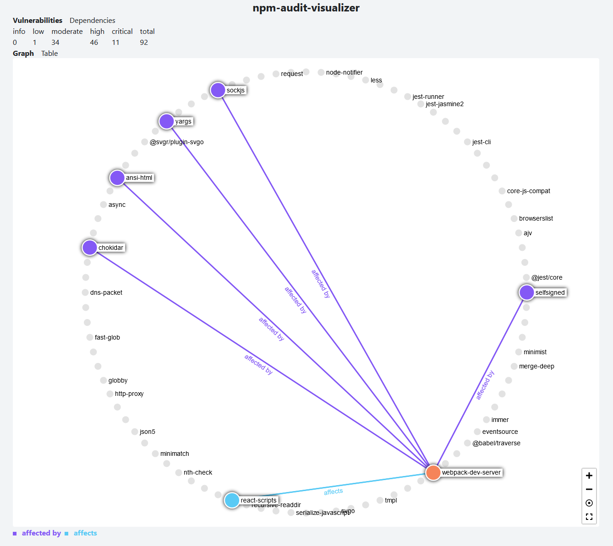
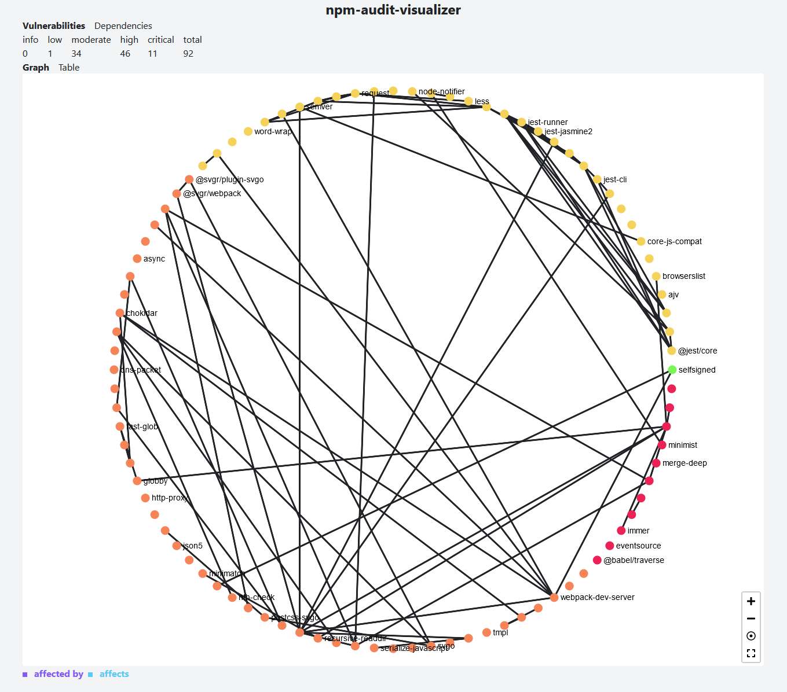
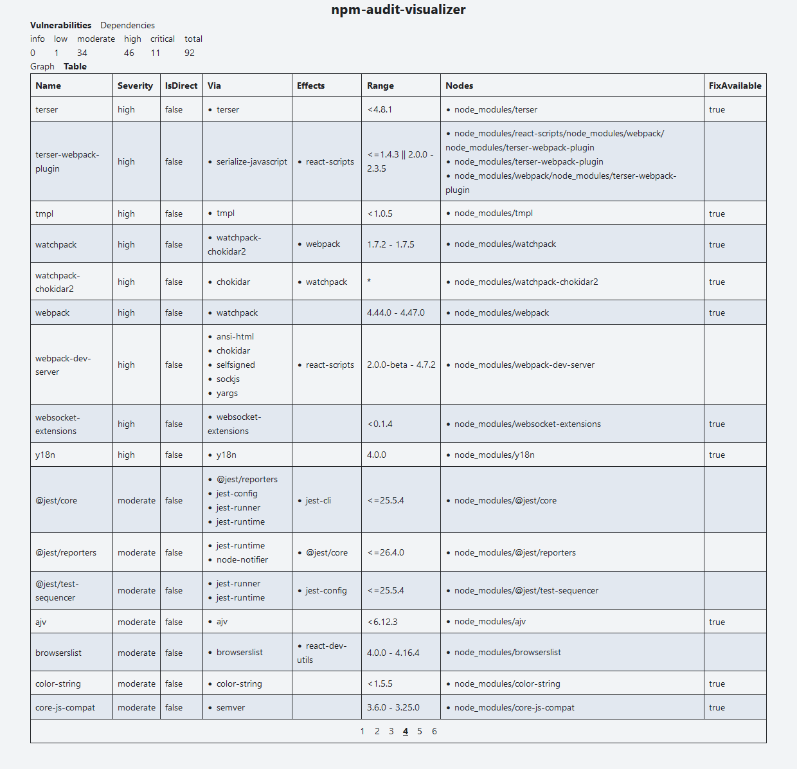

# npm-audit-visualizer

A web-based tool to visualize audit reports generated by `npm audit`.

> Disclaimer: This tool is still in its alpha phase.

## Previews

<div align="center">
  
  
  
</div>

## Get the tool

```shell
npm install -g npm-audit-visualizer
```

To verify that the installation was successful, please try the `--help` flag:

```shell
npm-audit-visualizer --help
```

## Usage

Navigate to a project that has package vulnerabilities and generate an audit
report:

```shell
npm audit --json > audit.json
```

Then, run the tool on the generated audit report:

```shell
npm-audit-visualizer -f audit.json
```

By default, this should automatically open a new page in your web browser at the
URL: `http://localhost:1248`. If it does not, please try navigating to that URL
manually.

## About

### What

`npm-audit-visualizer` is a web-based tool to visualize audit reports generated
by `npm audit`.

### Why

With v7 of npm, the `npm audit` command was updated & it no longer displays
results in a tabular format.

While the new format is still useful, there were some visual elements to the old
tabular format that made it easier to trace vulnerability paths & dependencies.

As a result, the goal of this tool is to re-provide a visual interface for audit
reports, which can hopefully make it quicker and easier to identify and resolve
vulnerabilities within npm-managed projects.

### How

> TODO

## Development

This section will describe how to get the project setup for local development.

### Dependencies

To work with this project, you will need to have the following dependencies
installed:

- Node.js (v20+)
  - [Official](https://nodejs.org/en/download)
  - [fnm](https://github.com/Schniz/fnm)
  - [nvm](https://github.com/nvm-sh/nvm)

### Get the source

This project is hosted at: https://github.com/nrednav/npm-audit-visualizer

To clone it locally:

HTTPS:

```shell
git clone https://github.com/nrednav/npm-audit-visualizer.git
```

SSH:

```shell
git clone git@github.com:nrednav/npm-audit-visualizer.git
```

### Installation

To install the project's dependencies:

```shell
cd npm-audit-visualizer/
npm install
```

### Building

To build the project:

```shell
npm run build
```

This will also build the `web-app`.

### Testing

To run all the project's tests:

```shell
npm run test
```

Alternatively, you can run just the `web-app` tests with:

```shell
npm run test:web-app
```

### Run

To run the tool:

```shell
npm run dev -- -f <path/to/audit.json>
```

You can also run the tool in `debug` mode using the `-d` flag:

```shell
npm run dev -- -d -f <path/to/audit.json>
```

This will output additional logs for each stage the tool completes.

## Issues & Requests

To request a new feature or report a bug, please open an issue by clicking
[here](https://github.com/nrednav/npm-audit-visualizer/issues/new).

## Resources

- [npm-audit v10](https://docs.npmjs.com/cli/v10/commands/npm-audit)
